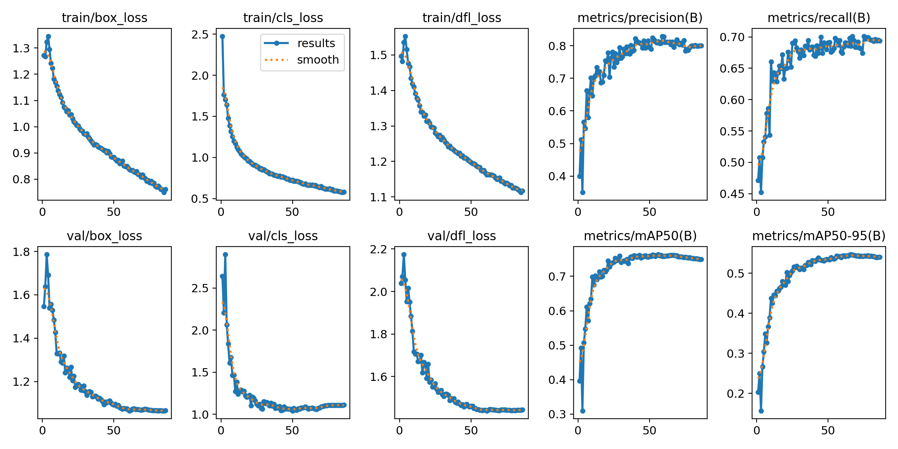
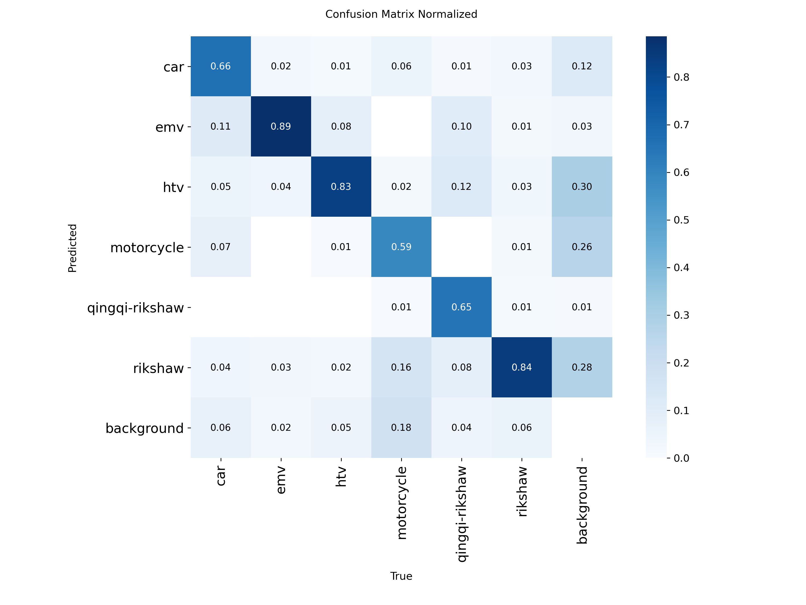

# Fine-Tuning Experiment: YOLOv8 on Pakistani Vehicle Dataset

> **Status: exploratory, not used in the current pipeline.**
> `src/speed_tracker.py` runs on stock `yolov8n.pt` (COCO pretrained). This
> document records a fine-tuning experiment on a custom local-vehicle
> dataset, kept here as documentation of the diagnostic process rather than
> a component of the deployed system.

## Setup

- **Base model:** YOLOv8n (`yolov8n.pt`), fine-tuned via `experiments/train.py`
- **Dataset:** [vehicletest2](https://www.kaggle.com/datasets/abuzarkhaaan/vehicletest2) via Roboflow (`abuzarkhaaan/vehicccc`, v3), 6 classes
- **Classes:** `car`, `emv`, `htv`, `motorcycle`, `qingqi-rikshaw`, `rikshaw`
- **Training:** 86 epochs, Tesla T4 (Colab), image size 640, batch 16
- **Validation set:** 1,167 images, 2,348 vehicle instances

## Training curves

- Both training and validation losses (`box_loss`, `cls_loss`, `dfl_loss`) dropped sharply in the first ~20 epochs, as expected for fine-tuning from COCO-pretrained weights.
- **Validation loss plateaued around epoch 55–60** and stayed flat through epoch 86, while training loss kept decreasing slowly — a mild overfitting signature. This means the checkpoint saved as `best.pt` is from roughly that plateau region, not the final epoch.
- `mAP50` peaked around epoch 57 (~0.764) and oscillated between 0.75–0.76 for the remaining ~30 epochs without further gains.

## Final validation metrics (overall)

| Metric | Value |
|---|---|
| Precision | 0.812 |
| Recall | 0.686 |
| mAP50 | 0.761 |
| mAP50-95 | 0.547 |

## Per-class breakdown

| Class | Images | Instances | Precision | Recall | mAP50 | mAP50-95 |
|---|---|---|---|---|---|---|
| car | 106 | 319 | 0.778 | 0.749 | 0.788 | 0.570 |
| emv | 112 | 131 | 0.766 | 0.893 | 0.911 | 0.727 |
| htv | 368 | 612 | 0.826 | 0.786 | 0.840 | 0.608 |
| **motorcycle** | 134 | 380 | 0.720 | **0.508** | **0.543** | **0.284** |
| qingqi-rikshaw | 96 | 118 | 0.910 | 0.598 | 0.718 | 0.547 |
| rikshaw | 499 | 788 | 0.873 | 0.584 | 0.769 | 0.544 |

The aggregate mAP50-95 of 0.547 hides a large spread — `emv` performs strongly (0.727) while `motorcycle` sits at roughly half the average (0.284). This gap, not the overall number, is the real finding of this experiment.

## Diagnosing the motorcycle gap

### Confusion matrix

Reading the `motorcycle` column (true label = motorcycle) in the normalized matrix:

- **59%** correctly predicted as motorcycle
- **18%** predicted as background — missed entirely, no detection fired
- **16%** predicted as rikshaw — a real, systematic visual confusion
- **6%** predicted as car

So the recall shortfall splits into two distinct failure modes that need different fixes, not one:

1. **Missed detections (18%)** — consistent with motorcycles being small in-frame, frequently clustered, and partially occluded in dense traffic. Likely addressable with higher training/inference resolution (`imgsz=960` or `1280`), since small-object detection benefits disproportionately from more pixels.
2. **Motorcycle → rikshaw confusion (16%)** — cross-checking the `rikshaw` row confirms this is specific to motorcycles (16% of true motorcycles land there) rather than a general three-wheeler mix-up (`qingqi-rikshaw` cross-contamination is much lower, ~1%). This points to a genuine data/visual-ambiguity issue — likely loaded motorcycles or certain viewing angles — rather than something a training-hyperparameter change would fix on its own.

### Ruling out a competing theory: mixed annotation formats

The dataset triggered an Ultralytics warning about mixed box/segmentation-style labels (368 of 1,167 validation label files used segment polygons rather than plain boxes, which get silently converted to boxes on load). Before concluding motorcycle's issue was label quality, this was checked directly:

| Class ID | Class | Segment-style label instances |
|---|---|---|
| 0 | car | 53 |
| 1 | emv | 4 |
| 2 | htv | 219 |
| 3 | motorcycle | 62 |
| 4 | qingqi-rikshaw | 0 |
| 5 | rikshaw | 30 |

`htv` had by far the most segment-style (reformatted) labels — 219 instances — yet it's the second-best performing class (0.608 mAP50-95). If mismatched annotation format were driving poor performance, `htv` should have suffered too; it didn't. Motorcycle's 62 segment-style instances (~16% of its total) are a minor, secondary contributor at most. **Conclusion: the annotation-format mismatch does not explain the motorcycle gap** — object size/density and motorcycle-rikshaw visual similarity are the more likely drivers.

## Why this wasn't shipped

Given:
- Nearly 1 in 3 motorcycles going undetected (recall 0.51) is a serious gap for traffic that is motorcycle-heavy
- Closing it credibly requires either a resolution increase (more compute/inference cost) or additional, better-chosen training data (more motorcycle examples, ideally including the ambiguous rikshaw-adjacent cases) — neither is a quick fix
- The general pretrained model (`yolov8n.pt`) already handles car/motorcycle/bus/truck reliably, just without the local-specific classes

the pragmatic choice for the current version of this project was to ship on the stock model and treat this fine-tuning pass as a documented, in-progress investigation rather than a production component.

## If revisited

1. Retrain at `imgsz=960` or `1280` to address the small-object miss rate
2. Source additional motorcycle-heavy training data, ideally with cases visually adjacent to rikshaws
3. Check whether oversampling motorcycle images (duplicating them in the training list) closes part of the recall gap without new data
4. Re-run the same confusion-matrix diagnostic after any change to confirm the motorcycle→rikshaw confusion specifically narrows, not just the aggregate mAP